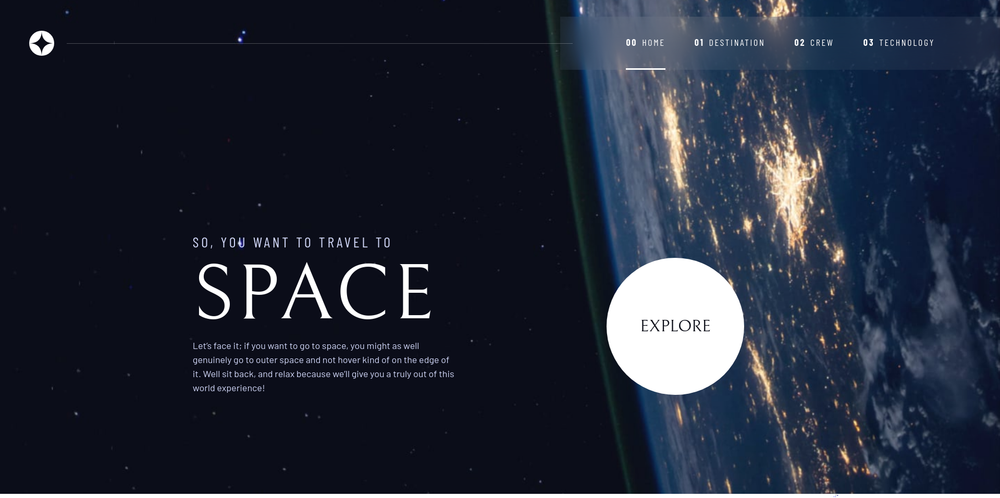

# Frontend Mentor - Space tourism website solution

This is a solution to the [Space tourism website challenge on Frontend Mentor](https://www.frontendmentor.io/challenges/space-tourism-multipage-website-gRWj1URZ3).

## Table of contents

- [Overview](#overview)
  - [Screenshot](#screenshot)
  - [Links](#links)
- [My process](#my-process)
  - [Built with](#built-with)
- [Author](#author)
- [Acknowledgments](#acknowledgments)

## Overview

### Screenshot

### Links

- Solution URL: [https://github.com/markrajk/fm_space_tourism](https://github.com/markrajk/fm_space_tourism)
- Live Site URL: [https://markrajk.github.io/fm_space_tourism/](https://markrajk.github.io/fm_space_tourism/)

## My process

### Built with

- Semantic HTML5 markup
- CSS custom properties
- Flexbox
- CSS Grid
- Mobile-first workflow

## Author

- Website - [web-apprentice.com](https://www.web-apprentice.com/)
- Frontend Mentor - [@markrajk](https://www.frontendmentor.io/profile/markrajk)

## Acknowledgments

[Kevin Powell](https://www.kevinpowell.co/)
